# graph-spec 项目总图

> 生成时间：2026-04-09
> 模式：project
> 工作目录：/Users/kuang/xiaobu/graph-spec

---

## 1. 项目概览

- **名称**：graph-spec（兼容 graphify 命令）
- **版本**：0.1.0
- **定位**：Node.js CLI 工具，将代码/文档/图片等多种文件类型转换为可查询知识图谱
- **入口**：`bin/graph-spec.js` → `src/cli.js`
- **公开 API**：`src/index.js`（flat re-export 所有模块）
- **运行时**：Node.js ≥ 20.11，CommonJS 模块

---

## 2. 架构层次图

```mermaid
graph TD
    subgraph CLI层
        BIN[bin/graph-spec.js]
        CLI[src/cli.js - 命令分发]
    end

    subgraph 核心Pipeline层
        PIPE[src/pipeline.js - runPipeline]
        CFG[src/config.js - resolveOutputDir]
        DETECT[src/detect.js - detect/classifyFile]
        EXTRACT[src/extract.js - extract]
        BUILD[src/build.js - build/buildFromJSON]
        CLUSTER[src/cluster.js - cluster/scoreAll]
        EXPORT[src/export.js - exportGraph]
        CACHE[src/cache.js - loadCached/saveCached]
        MANIFEST[src/manifest.js - saveManifest]
    end

    subgraph 图数据层
        GRAPH[src/graph.js - createGraph/mergeNode/addEdge]
        VALIDATE[src/validate.js - validateExtraction]
        ANALYZE[src/analyze.js - godNodes/surprisingConnections]
        REPORT[src/report.js - renderReport]
    end

    subgraph 查询服务层
        SERVE[src/serve.js - loadGraph/queryGraph/bfs/dfs]
    end

    subgraph 扩展输出层
        WIKI[src/wiki.js - toWiki]
        OBSIDIAN[src/obsidian.js - toObsidian]
        NEO4J[src/neo4j.js - toNeo4jCypher/pushToNeo4j]
        MCP[src/mcp.js - serveMcp]
    end

    subgraph 基础设施层
        LANGS[src/languages.js - 语言配置/Regex]
        INGEST[src/ingest.js - ingestUrl]
        WATCH[src/watch.js - _rebuildCode/watch]
        HOOKS[src/hooks.js - install/uninstall]
        INSTALL[src/install.js - writeClaude/writeAgents]
        SECURITY[src/security.js - validateUrl/sanitizeLabel]
        BENCH[src/benchmark.js - runBenchmark]
    end

    BIN --> CLI
    CLI --> PIPE
    CLI --> SERVE
    CLI --> WIKI
    CLI --> OBSIDIAN
    CLI --> NEO4J
    CLI --> MCP
    CLI --> INGEST
    CLI --> WATCH
    CLI --> HOOKS
    CLI --> INSTALL
    CLI --> BENCH

    PIPE --> CFG
    PIPE --> DETECT
    PIPE --> EXTRACT
    PIPE --> BUILD
    PIPE --> CLUSTER
    PIPE --> EXPORT
    PIPE --> CACHE
    PIPE --> MANIFEST

    EXTRACT --> LANGS
    EXTRACT --> DETECT
    BUILD --> GRAPH
    BUILD --> VALIDATE
    CLUSTER --> GRAPH
    EXPORT --> REPORT
    EXPORT --> GRAPH
    EXPORT --> WIKI
    ANALYZE --> GRAPH
    ANALYZE --> CLUSTER
    REPORT --> ANALYZE
    REPORT --> CLUSTER
    SERVE --> GRAPH
    SERVE --> SECURITY
    WIKI --> GRAPH
    WIKI --> ANALYZE
```



---

## 3. 核心模块详情

### 3.1 `src/pipeline.js` — 主管线（核心协调者）

**作用**：串联 detect → extract → build → cluster → export 全流程。

**关键函数**：
- `runPipeline(root, options)` → `{ root, outDir, graph, communities, detected, outputs }`

**流程**：
```
detect(root) → [files]
  → foreach: loadCached || extract(file)  (增量缓存)
  → build(extractions)  → graph
  → cluster(graph)      → communities
  → exportGraph(graph, outDir, communities)  → outputs
  → saveManifest(...)
```

---

### 3.2 `src/detect.js` — 文件发现与分类

**作用**：扫描目录，识别支持的文件类型，过滤敏感/忽略文件。

**关键函数**：
- `detect(root, options)` → `{ files: [{path, type, words}], manifestPath }`
- `classifyFile(filePath)` → `'code' | 'doc' | 'paper' | 'image' | 'office' | null`

**支持类型**：
- 代码：`.py .ts .js .go .rs .java .c .cpp` 等 20+ 语言
- 文档：`.md .txt .rst`
- 论文：`.pdf`
- 图片：`.png .jpg .jpeg .gif .webp .svg`
- Office：`.docx .xlsx`

---

### 3.3 `src/extract.js` — 内容提取与节点生成

**作用**：将文件内容转为 `{nodes, edges, hyperedges}` 提取结构。

**关键函数**：
- `extract(filePath, options)` → `{ nodes, edges, hyperedges, meta }`
- `extractCode(filePath, root)` — 解析函数/类/import/继承关系（Regex + tree-sitter）
- `extractStructuredText(filePath, root, fileType)` — Markdown/txt 解析标题/段落
- `extractImage(filePath)` — 图片元数据节点
- `extractMany(paths, options)` — 批量提取

**依赖**：`src/languages.js`（语言 Regex 配置）、`src/detect.js`（文件分类）、`gray-matter`（YAML frontmatter）

---

### 3.4 `src/languages.js` — 语言识别与解析配置

**作用**：为每种语言提供 function/class/import/inherit 的正则模式和 tree-sitter 语言包配置。

**关键导出**：
- `getLanguageConfig(lang)` → `{ functionPatterns, classPatterns, importPatterns, inheritPatterns }`
- `languageFromPath(filePath)` → 语言字符串

---

### 3.5 `src/graph.js` — 图数据结构

**作用**：定义内存图结构，提供节点/边的 CRUD 操作。

**数据结构**：
```js
{
  nodes: Map<id, node>,
  edges: Array<{source, target, relation, confidence}>,
  hyperedges: Array<{nodes, relation}>,
  adjacency: Map<id, Set<id>>,
  degrees: Map<id, number>,
  meta: {}
}
```

**关键函数**：
- `createGraph()` / `fromJSON(json)` / `toJSON(graph)`
- `mergeNode(graph, node)` — 合并去重
- `addEdge(graph, edge)` / `addHyperedge(graph, hyperedge)`
- `degree(graph, nodeId)` / `neighbors(graph, nodeId)`

---

### 3.6 `src/build.js` — 图构建

**作用**：将多个文件提取结果合并成一个完整图。

**关键函数**：
- `buildFromJSON(extraction)` → graph（单文件）
- `build(extractions)` → graph（合并多文件，节点去重，跨文件边保留）

---

### 3.7 `src/cluster.js` — 社区检测

**作用**：使用 Louvain 算法划分图社区，评估社区内聚度。

**关键函数**：
- `cluster(graph)` → `{ communities: {cid: [nodeIds]}, graph (enriched) }`
- `scoreAll(graph, communities)` → `{ cid: cohesionScore }`
- `cohesionScore(graph, nodeIds)` → number

**依赖**：`graphology` + `graphology-communities-louvain`

---

### 3.8 `src/analyze.js` — 图分析

**作用**：识别关键节点（God Nodes）、桥接连接、生成建议问题。

**关键函数**：
- `godNodes(graph, topN)` → `[{label, edges, community}]`
- `surprisingConnections(graph, communities, topN)` → `[{source_label, target_label, relation, confidence}]`
- `suggestQuestions(graph, communities, topN)` → `[string]`
- `graphDiff(oldGraph, newGraph)` → `{ added, removed, modified }`

---

### 3.9 `src/export.js` — 多格式导出

**作用**：将图输出为 JSON / HTML / GraphML / Cypher / Wiki 等多种格式。

**关键函数**：
- `exportGraph(graph, outDir, communities, options)` → `{ graphJson, reportPath, htmlPath, ... }`
- `toJSON` / `toHTML` / `toGraphML` / `toCypher` / `toSvg`

---

### 3.10 `src/serve.js` — 图查询服务

**作用**：加载已导出的图，提供 BFS/DFS 查询、最短路径、节点查找等。

**关键函数**：
- `loadGraph(graphPath)` → graph
- `queryGraph(graph, question, opts)` — 基于关键词 BFS/DFS 子图检索
- `bfs(graph, startNodes, depth)` / `dfs(graph, startNodes, depth)`
- `shortestPath(graph, source, target, maxHops)`
- `getNode` / `getNeighbors` / `getCommunity` / `graphStats`
- `subgraphToText(graph, nodeIds, edges, tokenBudget)` — token 预算文本序列化

---

### 3.11 `src/mcp.js` — MCP 服务器

**作用**：暴露知识图谱为 MCP（Model Context Protocol）工具集，供 AI 代理调用。

**工具定义**：
- `query_graph` — BFS/DFS 查询
- `get_node` — 节点详情
- `get_neighbors` — 邻居列表
- `get_community` — 社区节点
- `shortest_path` — 最短路径
- `graph_stats` — 图统计
- `god_nodes` — 关键节点
- `surprising_connections` — 桥接连接
- `suggest_questions` — 建议问题

---

### 3.12 `src/ingest.js` — URL 内容摄取

**作用**：从 URL 抓取内容（网页/PDF/图片/arxiv/tweet），生成 Markdown 文件供后续提取。

**关键函数**：
- `ingestUrl(url, options)` → `{ filePath, type }`

**依赖**：`src/security.js`（URL 验证）、`mammoth`、`pdfjs-dist`、`xlsx`

---

### 3.13 `src/watch.js` — 文件监听

**作用**：监听文件变化，自动触发增量重建。

**关键函数**：
- `_rebuildCode(watchPath, options)` — 用于 git hook 调用
- `watch(watchPath, options)` — chokidar 文件监听主循环

---

### 3.14 `src/hooks.js` — Git Hook 管理

**作用**：在 git `post-commit` / `post-checkout` 中注入自动重建脚本。

**关键函数**：
- `install(pathArg)` / `uninstall(pathArg)` / `status(pathArg)`

---

### 3.15 `src/wiki.js` / `src/obsidian.js` — Wiki / Obsidian 导出

**作用**：将图转换为可导航的 Markdown wiki 或 Obsidian Vault。

---

### 3.16 `src/neo4j.js` — Neo4j 集成

**作用**：生成 Cypher 语句或直接推送到 Neo4j 实例。

**关键函数**：
- `toNeo4jCypher(graphPath, outputPath)`
- `pushToNeo4j(graphPath, url, user, password)`

---

### 3.17 `src/cache.js` — 提取缓存

**作用**：基于文件内容 hash 缓存提取结果，实现增量构建。

**关键函数**：
- `loadCached(filePath, root, outDir)` → extraction | null
- `saveCached(filePath, extraction, root, outDir)`
- `fileHash(filePath)` → sha256 hex

---

### 3.18 `src/install.js` — AI 平台集成安装

**作用**：向 Claude / Codex / OpenCode / Claw / Droid 等平台写入 graph-spec MCP 配置。

**关键函数**：
- `writeClaude(root)` / `writeAgents(root)`
- `uninstallClaude(root)` / `uninstallAgents(root)`

---

### 3.19 `src/security.js` — 安全工具

**作用**：URL 白名单验证、标签文本清理，防止注入。

**关键函数**：
- `validateUrl(url)` — 拒绝 file:// 及内网地址
- `sanitizeLabel(str)` — XSS 清理

---

## 4. 关键跨模块流程

### 4.1 build 命令主流程

```
cli.js: case 'build'
  → runPipeline(root, options)           [pipeline.js]
    → resolveOutputDir(root, outDir)     [config.js]
    → detect(root)                       [detect.js]
    → foreach file:
        loadCached || extract(file)      [cache.js / extract.js]
          ← getLanguageConfig()          [languages.js]
    → build(extractions)                 [build.js]
        ← createGraph/mergeNode/addEdge  [graph.js]
        ← validateExtraction             [validate.js]
    → cluster(graph)                     [cluster.js] ← graphology
    → exportGraph(graph, outDir, ...)    [export.js]
        ← renderReport(graph, analysis)  [report.js]
          ← godNodes/surprisingConnections [analyze.js]
        ← toWiki / toHTML / toJSON       [wiki.js / export.js]
    → saveManifest(...)                  [manifest.js]
```

### 4.2 query 命令流程

```
cli.js: case 'query'
  → loadGraph(graphPath)    [serve.js]
  → queryGraph(graph, q)    [serve.js]
      → scoreNodes → bfs/dfs → subgraphToText
  → console.log(result)
```

### 4.3 mcp 命令流程

```
cli.js: case 'mcp'
  → serveMcp(graphPath)     [mcp.js]
      → loadGraph           [serve.js]
      → Server (MCP SDK)
      → 注册 9 个工具
      → StdioServerTransport
```

### 4.4 watch 命令流程

```
cli.js: case 'watch'
  → watch(root)             [watch.js]
      → chokidar.watch(root)
      → on('change'): _rebuildCode(root)
          → runPipeline(root)   [pipeline.js]
```

---

## 5. 外部依赖

| 包 | 用途 | 使用模块 |
|---|---|---|
| `commander` | CLI 参数解析 | cli.js |
| `graphology` | 图数据结构（Louvain 输入） | cluster.js |
| `graphology-communities-louvain` | 社区检测算法 | cluster.js |
| `@kreuzberg/tree-sitter-language-pack` | 多语言 AST 解析 | extract.js |
| `chokidar` | 文件监听 | watch.js |
| `fast-glob` | 文件 glob 扫描 | detect.js |
| `gray-matter` | YAML frontmatter 解析 | extract.js |
| `ignore` | .gitignore 规则处理 | detect.js |
| `mammoth` | Word(.docx) 转文本 | ingest.js |
| `pdfjs-dist` | PDF 文本提取 | ingest.js / extract.js |
| `xlsx` | Excel 文件处理 | ingest.js |
| `neo4j-driver` | Neo4j 推送 | neo4j.js |
| `@modelcontextprotocol/sdk` | MCP 服务器协议 | mcp.js |

---

## 6. 热点文件与风险点

| 文件 | 行数 | 重要性 | 风险 |
|---|---|---|---|
| `src/cli.js` | 586 | ★★★★★ | 所有命令入口，改动影响面广 |
| `src/extract.js` | 373 | ★★★★★ | 核心提取逻辑，Regex 维护成本高 |
| `src/obsidian.js` | 317 | ★★★☆☆ | 复杂的 Obsidian 结构生成 |
| `src/ingest.js` | 255 | ★★★★☆ | 网络请求/URL 安全验证关键 |
| `src/languages.js` | 254 | ★★★★☆ | 语言 Regex 配置，漏洞影响所有代码提取 |
| `src/wiki.js` | 241 | ★★★☆☆ | Wiki 生成逻辑 |
| `src/export.js` | 219 | ★★★★☆ | 多格式输出协调 |
| `src/mcp.js` | 218 | ★★★★☆ | MCP 工具定义与安全 |
| `src/serve.js` | 199 | ★★★★☆ | 查询性能关键路径 |

---

## 7. 输出产物结构

```
graphify-out/              (默认 outDir，可配置)
├── graph.json             # 图数据（节点+边+社区）
├── GRAPH_REPORT.md        # God Nodes / 社区报告
├── graph.html             # 可视化 HTML
├── graph.graphml          # GraphML 格式
├── graph.cypher           # Neo4j Cypher
├── graph.svg              # SVG 可视化
├── manifest.json          # 文件清单+hash
├── .cache/                # 提取缓存（按 hash）
├── wiki/                  # Markdown wiki（toWiki）
└── obsidian/              # Obsidian Vault（toObsidian）
```

---

## 8. CLI 命令速查

| 命令 | 说明 |
|---|---|
| `graph-spec build [root]` | 构建知识图谱 |
| `graph-spec add <url>` | 摄取 URL 内容 |
| `graph-spec query <question>` | 查询图谱 |
| `graph-spec path <src> <dst>` | 最短路径 |
| `graph-spec explain <node>` | 节点解释 |
| `graph-spec wiki [graph] [outDir]` | 生成 Wiki |
| `graph-spec obsidian [graph] [outDir]` | 生成 Obsidian Vault |
| `graph-spec neo4j [graph]` | 推送 Neo4j |
| `graph-spec mcp [graph]` | 启动 MCP 服务器 |
| `graph-spec hook install/uninstall/status` | Git hook 管理 |
| `graph-spec install [--platform=claude\|codex\|...]` | AI 平台集成 |
| `graph-spec watch [root]` | 文件监听自动重建 |
| `graph-spec benchmark [graph]` | 性能基准测试 |
| `graph-spec config [root]` | 显示配置 |
